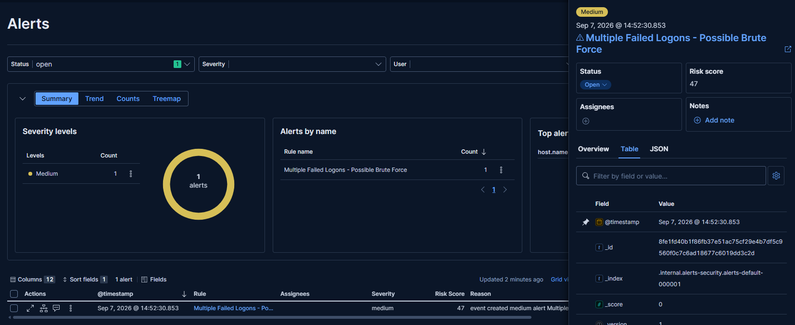
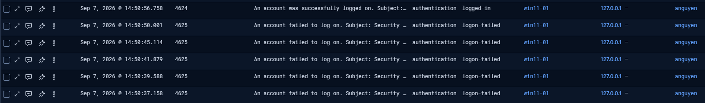
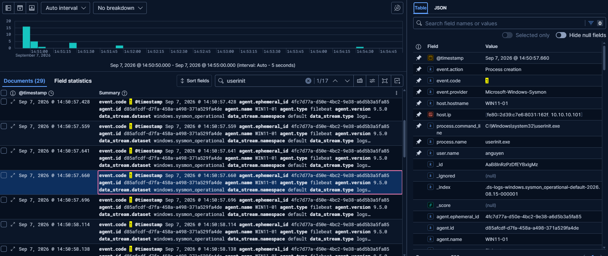

# Incident Report — Multiple Failed Logons Followed by Successful Authentication

| Field | Value |
|---|---|
| **Detection Rule** | Multiple Failed Logons - Possible Brute Force (custom Threshold rule) |
| **Date/Time** | 2026-09-07, 14:50:37–14:50:58 |
| **Analyst** | Peter Szots |
| **Severity** | Medium |
| **Host** | WIN11-01 (10.10.10.101) |
| **User** | LAB\anguyen |
| **MITRE ATT&CK** | Credential Access — T1110 (Brute Force) |
| **Verdict** | True Positive (Simulated) |

## Summary

Five failed logon attempts (Event ID 4625) for user `anguyen` occurred on WIN11-01 between
13:50:37–13:50:50 UTC, all bad-password failures from the local console. A successful logon
(Event ID 4624) for the same account followed 6 seconds later. Sysmon process creation events
confirm a legitimate interactive session started immediately after (`winlogon.exe` →
`userinit.exe` → `explorer.exe`, all under the same Logon ID). Matched a custom Elastic
threshold rule; confirmed as a controlled test, not a real intrusion.

## Investigation Details

**Failed logons (4625) — 5 events, 14:50:37–14:50:50:**
- Logon Type 2 (Interactive), Source 127.0.0.1 (local console)
- Status `0xC000006D` / Sub Status `0xC000006A` — bad password, valid username, all 5 identical

**Successful logon (4624) — 14:50:56.758:**
- Logon Type 11 (CachedInteractive), Logon ID `0xFDE41E`

**Sysmon correlation — Logon ID `0xfde41e` confirmed across:**

| Time (UTC) | Event | Process | Parent | User |
|---|---|---|---|---|
| 13:50:57.660 | Sysmon EID 1 | userinit.exe | winlogon.exe | LAB\anguyen |
| 13:50:58.114 | Sysmon EID 1 | explorer.exe | userinit.exe | LAB\anguyen |

Matching Logon ID across the 4624 and both Sysmon events confirms a genuine session started for
`anguyen` immediately following the successful authentication — not just a logged auth event with
no real session behind it.

## Analysis

All 5 failures share an identical bad-password signature against one valid account from the
local console — consistent with a mistyped password, not automated credential stuffing (which
typically shows tighter timing and/or multiple target usernames). The clean Sysmon process chain
under the matching Logon ID confirms the subsequent session was legitimate.

## MITRE ATT&CK Mapping

| Tactic | Technique | ID |
|---|---|---|
| Credential Access | Brute Force | T1110 |

## Verdict

**True Positive (Simulated)** — rule correctly detected the failed-logon pattern it was built for.
Activity confirmed benign (deliberate test).

## Recommended Actions

- No containment required (confirmed benign/simulated)
- Real-world equivalent with this evidence pattern (single source, consistent bad-password
  failures, fast legitimate success) would not warrant escalation
- Escalation trigger for future reference: multiple *different* target usernames from one source,
  or failures continuing past an account lockout threshold

## Screenshots

## Analyst Notes

Logon ID correlation (not just timestamp proximity) was essential here — an unrelated 4634
logoff event initially appeared to correlate by timestamp but had a different Logon ID, and
would have produced a misleading timeline if used at face value.
