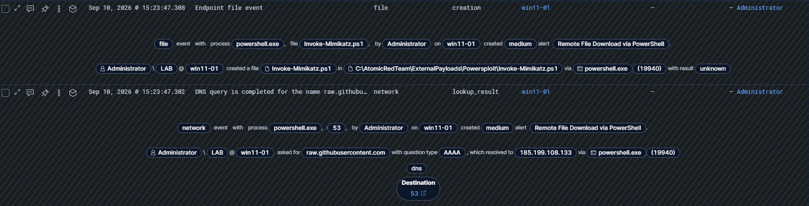
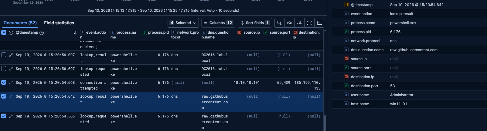
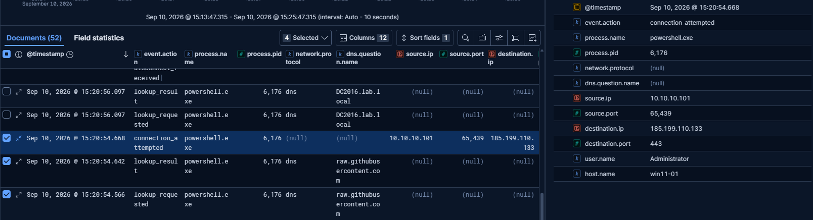
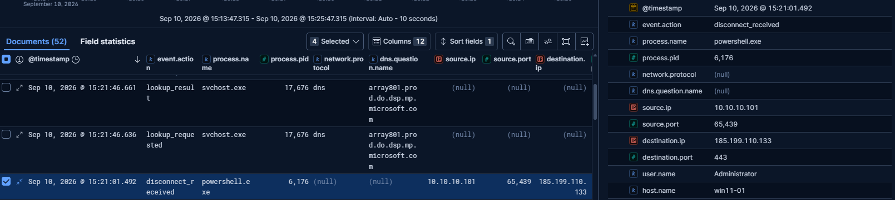
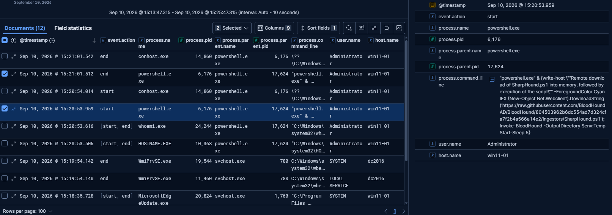
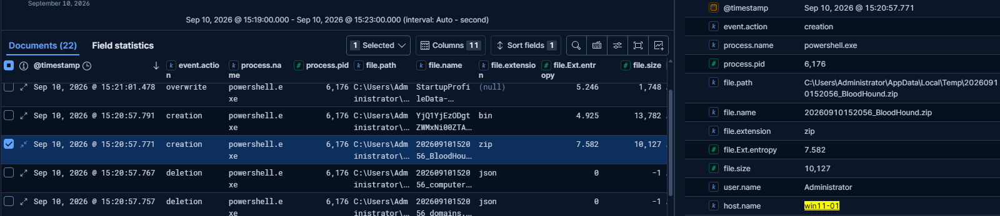

# Incident Report — Powershell remote file download and execution using Download Cradle

| Field | Value |
|---|---|
| **Detection Rule** | Remote File Download via PowerShell (Kibana prebuilt rule) |
| **Date/Time** | 2026-09-10, 15:20:53–15:21:01 BST/Local |
| **Analyst** | Peter Szots |
| **Severity** | Medium |
| **Host** | WIN11-01 (10.10.10.101) |
| **User** | LAB\Administrator |
| **MITRE ATT&CK** | T1105; T1059.001 |
| **Verdict** | True Positive (Simulated) |

## Summary

As part of a simulated test, a reconnaissance/AD discovery activity occurred against the WIN11-01 host between 
15:20:53–15:21:01. It involved a successful powershell instance creation (PID 6176) from a parent powershell pocess
(PID 17624), followed by a multiple DNS query and resolution (port 53) and an established outbound connection to a remote destination
(185.199.110.133) via port 443. The powershell command line process confirms the download of a "SharpHound.ps1" script
and its load into memory and execution (therefore no written file on disk). As a result a compressed file has been created
in temporary folder for later use (C:\Users\Administrator\AppData\Local\Temp\20260910152056_BloodHound.zip).

## Investigation Details

**PowerShell script download and execution - 2 events, 15:20:53–15:21:01:**
- Start process, powershell.exe PID 6176, parent process powershell.exe PID 17624, "SharpHound.ps1"
- End process 6176 (exit code 0); parent process 17624 remained active (confirmed by its own subsequent file-write event)

**DNS query and remote destination connection**

| Time | Event | Process | PID | Destination Port | IP |
|---|---|---|---|---|---|
| 15:20:54.642 | lookup | powershell.exe | 6176 | 53 | "185.199.110.133", "185.199.109.133", "185.199.108.133", "185.199.111.133" |
| 15:20:54.668 | connection | powershell.exe | 6176 | 443 | "185.199.110.133" |
| 15:21:01.492 | disconnect | powershell.exe | 6176 | 443 | "185.199.110.133" |

**File creation, 15:20:57**
- The process powershell.exe, PID 6176 creates compressed file to path "C:\Users\Administrator\AppData\Local\Temp\20260910152056_BloodHound.zip", file size 10127 bytes

Matching PID of powershell confirms powershell attack technique with its chain reaction of events from domain lookup and connection, script execution and file creation.  

## Analysis

All interrelated events indicates clean execution of the attack technique. The parent poweshell process has lauched child poweshell process,
where all consecutive chain events has been triggered. The SharpHound.ps1 script has been downloaded and executed into memory. 
As a result of a rich reconnaissance process, SharpHound's default collection output (typically computers/domains/groups/ous/users/gpos as JSON, per its known behavior) 
was compressed into the resulting zip archive and stored in temporary location for later use.

## MITRE ATT&CK Mapping

| Tactic | Technique | ID |
|---|---|---|
| Command and Control | Ingress Tool Transfer | T1105 |
| Execution | Command and Scripting Interpreter: PowerShell | T1059.001 |

## Verdict

**True Positive (Simulated)** — rule correctly detected the pattern it was built for.
Activity confirmed benign (deliberate test).

## Recommended Actions

- No blocking of remote destination required (confirmed benign/simulated)
- Recommend to harden powershell execution policy after completed tests (it was deliberately weakened for test attack script simulations)
- created compressed file to be erased

## Screenshots

## Analyst Notes

The prebuilt kibana detection rule was useful to trigger alert, however further investigation in logs were necessary for the full picture.
I have created 3 Kibana Discover log presets with appropriate fields to further simplify and speed up the analysis.
