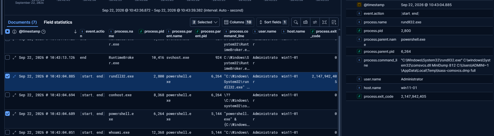
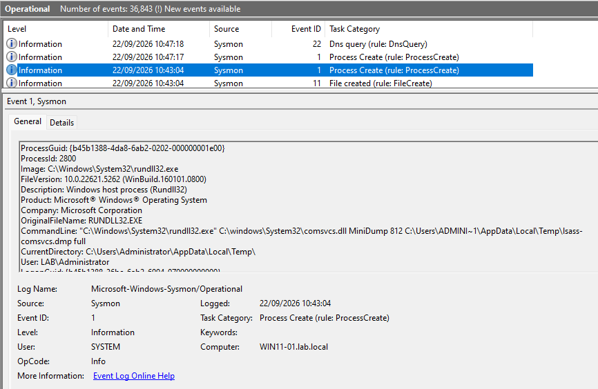
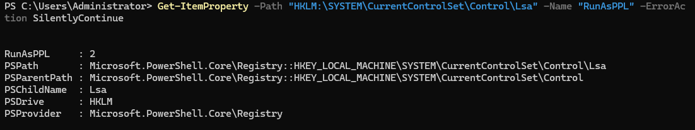

# Incident Report — Credential Dumping from LSASS.exe Memory using comsvcs.dll

| Field | Value |
|---|---|
| **Detection Rule** | Potential Credential Access via LSASS Memory Dump (prebuilt rule) |
| **Date/Time** | 2026-09-22, 09:43:04 UTC |
| **Analyst** | Peter Szots |
| **Severity** | High |
| **Host** | WIN11-01 (10.10.10.101) |
| **User** | LAB\Administrator |
| **MITRE ATT&CK** | T1003.001 |
| **Verdict** | True Positive (Attempted) |

## Summary

Part of a new attack simulation scenario, a "credential dump" technique attempted on the WIN11-01 host 
at 10:43:04. A PowerShell process (PID 6264), spawned from an elevated parent PowerShell session (PID 5144), 
executed a script block invoking the built-in comsvcs.dll via rundll32.exe to attempt a memory dump of lsass.exe, 
targeting offline credential extraction to a .dmp file in the user's Temp directory.
The process however failed to a Windows security feature, PPL (Protected Process Light) and the attack was unsuccessful.

## Investigation Details

**PowerShell process creation and MiniDump script execution - 2 events:**
- Spawn powershell.exe PID 6264 from parent process powershell.exe PID 5144 to search for LSASS.exe PID - evaluate script block:
*{C:\Windows\System32\rundll32.exe C:\windows\System32\comsvcs.dll, MiniDump (Get-Process lsass).id $env:TEMP\lsass-comsvcs.dmp full}*
- The script calls directly rundll32.exe (PID 2800) without using a PowerShell script block. Attempt to write dump file to Temp directory.
*"C:\Windows\System32\rundll32.exe" C:\windows\System32\comsvcs.dll MiniDump 812 C:\Users\ADMINI~1\AppData\Local\Temp\lsass-comsvcs.dmp full*

**Event failure and exit process**
- the rundll.exe PID 2800 process fails to complete, it exits with exit code 2147942405 (0x80070005 — Access Denied)

## Analysis

Sysmon provides evidence of the 2x EID 1 process creation powershell.exe → rundll32.exe process chain and full command lines.
Windows built in integrity-feature PPL (Protected Process Light) has blocked the process 
The execution failed to call OpenProcess() (without sufficient privilege - protected by PPL windows feature).
The OpenProcess call was denied at kernel level, the registry value shows RunAsPPL: 2 (the setting is UEFI locked), 
so Secure Boot would need to be disabled. That is why rundll32/comsvcs has failed to execute.
After verification of the Temp folder, the ".dmp" file was missing, was never been created.

## MITRE ATT&CK Mapping

| Tactic | Technique | ID |
|---|---|---|
| Credential Access | OS Credential Dumping: LSASS Memory | T1003.001 |

## Verdict

**True Positive (Attempted)** — attack attempt has failed to succeed thanks to mitigation
Technique Blocked / Prevented by control

## Recommended Actions

- EID 10/GrantedAccess would have been a detection evidence if PPL weren't in place.
- The prebuilt detection rule did not fire since Sysmon EID 10 never generated.

## Screenshots

## Analyst Notes

